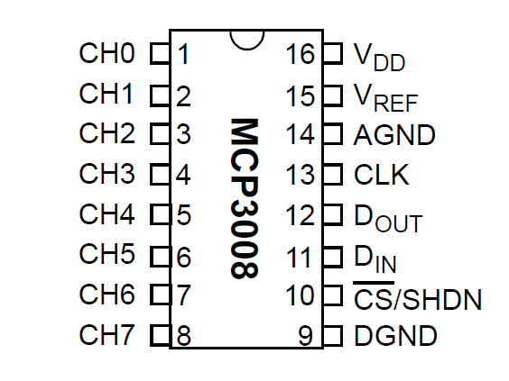

Reading a potentiometer is the next step, and it is a little bit more tricky.

The chip has an ADC, but as in my project I want to use several of them, I need to use an external one.

Great reference: http://adichip.com.ar/wp/adc-mcp3008-con-raspberry-pi/

For this, I will make use of the MCP3008. This is the pin layout:

All left pins (1 - 8) are read channels.
Right pins are 2 voltage lines (16 for the chip, 15 for the channel reference), the analog ground (14), the clock line (13), data out (12), data in (11), chip select (10), and data ground (9).

For this chapter, 16 and 15 go to Vcc3v3 (you can take it from the chip, first column, third pin), both grounds to ground (first column, first pin), and the four remaining lines go to the CHIP computer, in any XIO-Px pin. 

All the left lines are connected to what we want to read, which will be a couple of potentiometers (trimmers). Each trimmer has 3 pins. The middle one is what you "move" to divide the resistor to either side (remember this works like a variable voltage divider, where both resistors sum, in my case, 10kohm).

So plug both lefts to 3v3, both rights to ground, and both middles to a channel (5 and 7 in my case).

this is the completed circuit:

(image)

Now it is a matter of communicating with the MCP3008. It is not difficult, but why reinvent the wheel, someone has already done it for the Raspberry Pi. Here is my adaptation:

https://gist.github.com/AlexAti/7e58f12538fa4c957c982cb78af1add3

I played a little bit and created an X that I can move around the screen of my terminal, using one resistor for height and another one for width. Cool! I'm ready to create pong!!!

But that's not our target. Let's move to the next section!

    
